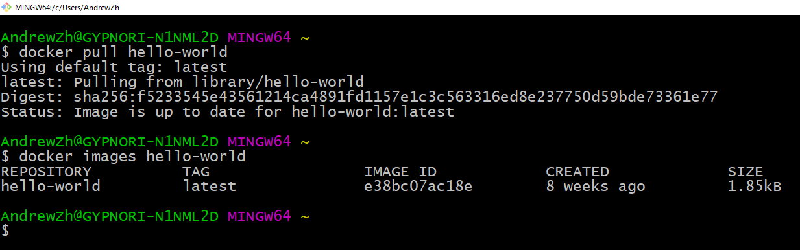

.. role:: badtext
.. role:: goodtext
.. role:: warntext
.. role:: containertext
.. role:: badbold
.. role:: goodbold
.. role:: warnbold
.. role:: containerbold

.. |STAR| image:: images/star.png
   :height: 50
   :width: 50

.. image:: images/docker.png
   :scale: 150 %
   :align: center

Andrii Zhuk
----------------------

.. class:: header-table

    +-------------------------+--------------------------+
    | + **12 years c++ dev**  | .. image:: images/me.jpg |
    | + **2 years Scala dev** |     :scale: 30 %         |
    |                         |     :align: right        |
    |     - **AWS cloud**     |                          |
    |     - **Docker**        |                          |
    +-------------------------+--------------------------+

.. Note: Questions at the end of the lecture
.. Question: Docker exp ? - you can leave any time, np
.. Question: QA? Dev? - just to understand, expect QAs. Will make fun of devs... myself :)
.. Question: bash? powershell? - good for you

A little history
----------------------

    **Virtual Machine** - isolated system

.. Why we do value VM ?

A little history
----------------------

    **Virtual Machine** - isolated system

    + :goodtext:`Do not depend on current system environment`

.. We can damage our system eith newly installing better/buggy/virusful version of mine sweaper.

A little history
----------------------

    **Virtual Machine** - isolated system

    + :goodtext:`Do not depend on current system environment`
    + :goodtext:`Universal`

A little history
----------------------

    **Virtual Machine** - isolated system

    + :goodtext:`Do not depend on current system environment`
    + :goodtext:`Universal`
    + :goodtext:`Security`

.. Say hello to intel spectre and meltdown problem.

A little history
----------------------

    **Virtual Machine** - isolated system

    + :goodtext:`Do not depend on current system environment`
    + :goodtext:`Universal`
    + :goodtext:`Security`
    + :goodtext:`If something goes wrong..`

A little history
----------------------

    **Virtual Machine** - isolated system

    + :goodtext:`Do not depend on current system environment`
    + :goodtext:`Universal`
    + :goodtext:`Security`
    + :goodtext:`If something goes wrong.. BOOM :)`
    + :badtext:`Manual work (OS installation, environment set up)`

A little history
----------------------

    **Virtual Machine** - isolated system

    + :goodtext:`Do not depend on current system environment`
    + :goodtext:`Universal`
    + :goodtext:`Security`
    + :goodtext:`If something goes wrong.. BOOM :)`
    + :badtext:`Manual work (OS installation, environment set up)`
    + :badtext:`Slow (full OS emulation)`

A little history
----------------------

    **Bitnami** - partial environment isolation

A little history
----------------------

    **Bitnami** - partial environment isolation

    + :goodtext:`Fast (Uses current system)`

A little history
----------------------

    **Bitnami** - partial environment isolation

    + :goodtext:`Fast (Uses current system)`
    + :goodtext:`Effective resources usage`

A little history
----------------------

    **Bitnami** - partial environment isolation

    + :goodtext:`Fast (Uses current system)`
    + :goodtext:`Effective resources usage`
    + :goodtext:`Easy to set up (Copy/Paste)`

A little history
----------------------

    **Bitnami** - partial environment isolation

    + :goodtext:`Fast (Uses current system)`
    + :goodtext:`Effective resources usage`
    + :goodtext:`Easy to set up (Copy/Paste)`
    + :goodtext:`If something goes wrong.. no BOOM :(, just remove it`

A little history
----------------------

    **Bitnami** - partial environment isolation

    + :goodtext:`Fast (Uses current system)`
    + :goodtext:`Effective resources usage`
    + :goodtext:`Easy to set up (Copy/Paste)`
    + :goodtext:`If something goes wrong.. no BOOM :(, just remove it`
    + :badtext:`System environment dependency`

A little history
----------------------

    **Bitnami** - partial environment isolation

    + :goodtext:`Fast (Uses current system)`
    + :goodtext:`Effective resources usage`
    + :goodtext:`Easy to set up (Copy/Paste)`
    + :goodtext:`If something goes wrong.. no BOOM :(, just remove it`
    + :badtext:`System environment dependency`
    + :badtext:`Security`

A little history
----------------------

    **Bitnami** + **Virtual machine** = **Docker**

    **Docker** - full environment isolation

A little history
----------------------

    **Bitnami** + **Virtual machine** = **Docker**

    **Docker** - full environment isolation

    + :goodtext:`Fast`

A little history
----------------------

    **Bitnami** + **Virtual machine** = **Docker**

    **Docker** - full environment isolation

    + :goodtext:`Fast`
    + :goodtext:`Effective resources usage`

A little history
----------------------

    **Bitnami** + **Virtual machine** = **Docker**

    **Docker** - full environment isolation

    + :goodtext:`Fast`
    + :goodtext:`Effective resources usage`
    + :goodtext:`Easy to set up`

A little history
----------------------

    **Bitnami** + **Virtual machine** = **Docker**

    **Docker** - full environment isolation

    + :goodtext:`Fast`
    + :goodtext:`Effective resources usage`
    + :goodtext:`Easy to set up`
    + :goodtext:`Security`

A little history
----------------------

    **Bitnami** + **Virtual machine** = **Docker**

    **Docker** - full environment isolation

    + :goodtext:`Fast`
    + :goodtext:`Effective resources usage`
    + :goodtext:`Easy to set up`
    + :goodtext:`Security`
    + :goodtext:`If something goes wrong.. BOOM :)`

Docker Advantages
----------------------

Docker Advantages
----------------------

    + :goodbold:`Fast` - no OS installation, using parts of current system

Docker Advantages
----------------------

    + :goodbold:`Fast` - no OS installation, using parts of current system
    + :goodbold:`Resources usage efficiency`

Docker Advantages
----------------------

   :goodbold:`Running multiple instances at the same time with no penalty, reusing unchanged data`

Docker Advantages
----------------------

   :goodbold:`No resources reservation`

Docker Advantages
-----------------------

    + :goodbold:`Easy to set up` - script base images

      - Automated tests, which may be used for *Build Server*

Docker Advantages
-----------------------

    + :goodbold:`Easy to set up` - script base images

      - Automated tests, which may be used for *Build Server*

    + :goodbold:`Easy to bind together` - run and test services communication (integration tests)

      - Easy compatibility tests (e.g. **new** *Frontend* with **old** *Backend*)

Docker Advantages
-----------------------

    + :goodbold:`Easy to set up` - script base images

      - Automated tests, which may be used for *Build Server*

    + :goodbold:`Easy to bind together` - run and test services communication (integration tests)

      - Easy compatibility tests (e.g. **new** *Frontend* with **old** *Backend*)

    + :goodbold:`Easy to deploy and migrate` - additional abstract layer.
      You are sure it will be the same on Production as you tested.

Docker Limitations
-----------------------

Docker Limitations
-----------------------

    + :badbold:`No interaction` |STAR|

      - Test native UI ? - Go back to VM
      - :goodbold:`Ideal` - web services (backend + frontend), server services

.. Talk about Jessie Frazelle

Docker Limitations
-----------------------

    + :badbold:`No interaction` |STAR|

      - Test native UI ? - Go back to VM
      - :goodbold:`Ideal` - web services (backend + frontend), server services

    + :badbold:`System type dependency`

      - **Native:** :containerbold:`Lin` on Lin (docker is Linux product after all)
      - **over VM:** :containerbold:`Win` on Win, :containerbold:`MacOS` on MacOS, :containerbold:`Lin` on Win, :containerbold:`Win` on Lin
      - :goodbold:`Ideal` - same system containers

Why do we need it ?
----------------------

    + **Easy** test piece of software
    + **Easy** run different software versions at the same time
    + **Easy** compatibility testing (e.g. new frontend + old backend)
    + **Easy** to create automation tests
    + **Easy** deploy piece of software
    + **Fast**
    + **Free**

Success stories
---------------

    **MetLife**

    * :goodbold:`-70%` VMs
    * :goodbold:`-67%` Cores
    * :goodbold:`10x`  Average CPU Utilization
    * :goodbold:`-66%` Cost Reduction

    **VISA** 

    * :goodbold:`deploying patches in seconds vs days`

Success stories
---------------

    **PayPal**

    * **18** month
    * **700+** apps
    * **150000** containers

    * :goodbold:`2x`  build-test-deploy cycles speed up
    * :goodbold:`20%` performance boost
    * :goodbold:`0`   code change

TASK: Test software without installation
----------------------------------------

    **Virtual\Machine** - isolated system

    * Install OS
    * Install needed environment
    * Copy binary files in proper place
    * Copy configuration
    * Run if you can
    * If something changed - repeat with **manual copy** with possible **human error**

TASK: Test software without installation
----------------------------------------

    **Docker** - full environment isolation

    * Write small script, more like configuration, which does all we need

      + Copy binary files in proper place
      + Copy configuration
      + Install needed environment

    * Build image and run if you can
    * If something changed - build image and run if you can. It's **automated** already

Installation
----------------------

     **Docker Enterprise Edition vs Community Edition**

     * :goodtext:`Based on the same opensource code - no difference in base functionality`
     * :goodtext:`Support`
     * :goodtext:`Images and plugins certifications`
     * :goodtext:`Vulnerability scan`

Linux Installation
----------------------

    * No problem, just install it
    * Ordinary user should be added to the **docker** group
    * :warnbold:`Note:` watch the space, */var/lib/docker*

Windows Installation
----------------------

    * :badbold:`Docker for windows` :badtext:`needs` :badbold:`HyperV`:badtext:`, which means` :badbold:`All other Hypervisors will be disabled`

      + Nested virtualization for **VmWare** will do the trick (watch the version)
      + **VirtualBox** does not support nested virtualization
      + **Dual Boot** (with HyperV or without)

Windows Installation
----------------------

    * Ordinary user should be added to **docker-users** group and **restart**
    * :warnbold:`Note:` switch to proper containers type Linux or Windows
    * :warnbold:`Note:` watch the space, change target directory

Docker fact I
---------------------------

    **Images vs Containers**

    * **Image** is buildable and static
    * **Container** is runnable.
    * We can run any number of **containers** out of the same **image**

Layered filesystem and Copy-on-Write
-------------------------------------

Docker fact II
---------------------------

    **Docker HUB**

    * Central images repository
    * There are already **base images** available there
    * You can register your **own images** for the **public**

Docker fact III
---------------------------

    **Docker has GUI**

.. class:: header-table

    +---------------+-----------------+
    | + Kitematic   | + Portainer     |
    +---------------+-----------------+
    | + Dockstation | + Shipyard      |
    +---------------+-----------------+
    | + Rancher     | + and many more |
    +---------------+-----------------+

.. not using - sometimes not possible, sometimes compatibility problem

Piece a cake (Hello world!)
---------------------------

    * **docker version** - get version, part of the sanity check
    * **docker images** - list local images
    * **docker pull** - get image from repository
    * **docker run** - run container

Piece a cake (Hello world!)
---------------------------

    * **docker version**
    * **docker images**
    * **docker pull hello-world**
    * **docker run hello-world**

.. Joke "does Microsoft knows about kilobytes?"

Piece a cake (Hello world!)
---------------------------

Let's play (Minecraft)
---------------------------

    **Filesystem Tree**

.. code:: plain

    Minecraft
    |-- Dockerfile
    |-- minecraft_server.1.12.2.jar
..

Let's play (Minecraft)
---------------------------

    **Dockerfile**

.. code:: bash

    FROM java:8                         # Base image (mandatory)
    ADD minecraft_server.1.12.2.jar /   # Copy file into image
    RUN mkdir -p /opt/minecraft         # Create work directory
    RUN echo "eula=true" > /opt/minecraft/eula.txt # Accept license
    EXPOSE 25565                        # Expose network port
    WORKDIR /opt/minecraft              # Set work directory
    # Set default command
    CMD java -Xmx1024M -Xms1024M -jar /minecraft_server.1.12.2.jar nogui
..

.. layers, read-write fs, resources efficiency

Let's play (Minecraft)
---------------------------

    * **docker build** - build image
    * **docker run** - run container
    * **docker ps** - get running containers
    * **docker stop** - stop running container
    * **docker rm** - remove stopped container
    * **docker image rm** - remove image

Let's play (Minecraft)
---------------------------

    * **docker build -t minecraft .**
    * **docker images**
    * **docker run  -d -p 25565:25565 --restart=always minecraft:latest**
    * **docker ps**
    * **docker stop <container id>**
    * **docker rm <container id>**
    * **docker image rm <image id>**

.. image version - tags

Let's play (Minecraft)
---------------------------

Do something useful (Chat Server)
---------------------------------

    **Filesystem Tree**

.. code:: plain

    simplechat
    |-- Dockerfile
    |-- chat
        |-- icons
        |-- libs
        |-- LICENSE
        |-- README.md
        |-- resources
        |-- run.sh
        |-- sounds

Do something useful (Chat Server)
---------------------------------

    **Dockerfile**

.. code:: bash

    FROM    debian:8                # Base image (mandatory)
    RUN     apt-get update && apt-get install -y libboost1.55-all-dev
    ENV     chatPath=/opt/chat      # Set environment variable
    RUN     mkdir -p $chatPath      # Create work directory
    COPY    chat        $chatPath   # Copy directory to work directory
    WORKDIR $chatPath               # Set work directory
    EXPOSE  8080/tcp                # Expose port
    CMD     ./run.sh                # Set default command
..

Do something useful (Chat Server)
---------------------------------

    * **docker build -t chat:0.1 .**
    * **docker images**
    * **docker run --name chat1 -p 8080:8080 --rm chat:0.1**
    * **docker run --name chat2 -p 8081:8080 --rm chat:0.1**
    * **docker ps**
    * **docker stop <container id>**
    * **docker rm <container id>**
    * **docker image rm <image id>**

.. TODO docker commit ?

Do something useful (Docker repository)
---------------------------------------

.. code:: bash

    # Run own repository
    docker run -d -p 5000:5000 --restart=always \
     --name registry registry:2

.. code:: bash

    # Tag the image as localhost:5000/my-chat.
    # This creates an additional tag for the existing image.
    # When the first part of the tag is a hostname and port, 
    # Docker interprets this as the location of a registry,
    # when pushing.
    docker tag chat:0.1 localhost:5000/my-chat
    # Push the image to the local registry running at localhost:5000
    docker push localhost:5000/my-chat

Do something useful (Docker repository)
---------------------------------------

.. code:: bash

    # Remove the locally-cached chat:0.1 and 
    # localhost:5000/my-chat images, 
    # so that you can test pulling the image from your registry.
    # This does not remove the localhost:5000/my-chat image
    # from your registry.
    docker image remove chat:0.1
    docker image remove localhost:5000/my-chat
    # Pull the localhost:5000/my-chat image from your local registry.
    docker pull localhost:5000/my-chat

.. So the QA will not become "Chupacabra" now, no thanks )

Summary
---------------------------------------

.. summarize all advantages based on examples
..

   **So now we know:**

   * Why do we need it and cases we can't use it
   * How to create docker image
   * How to put the image into repository
   * How to get the image from repository
   * How to run the container

Materials
---------------------------------

   - www.docker.com
   - https://github.com/ashlander/docker-lecture

.. image:: images/githublink.png
   :scale: 70 %
   :align: center

.. where published

